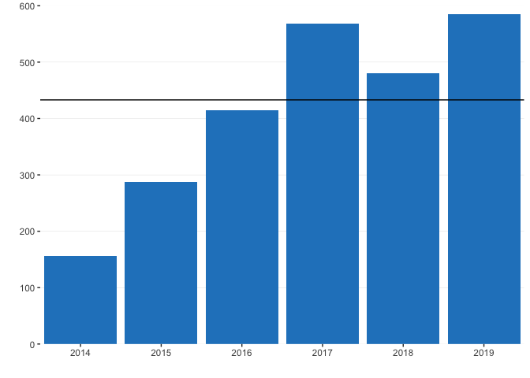
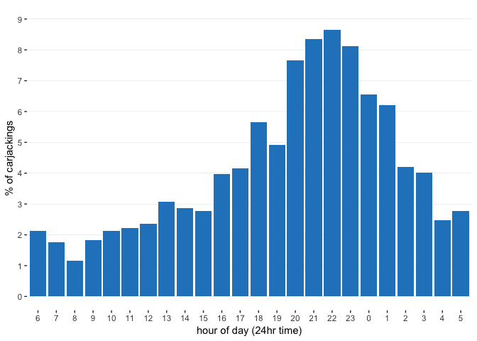

Analysis: Baltimore city carjackings, 2014 to Sept. 28, 2019
------------------------------------------------------------

The Baltimore Sun analyzed crime data from [Open
Baltimore](https://data.baltimorecity.gov/Public-Safety/BPD-Part-1-Victim-Based-Crime-Data/wsfq-mvij)
for a story about the increase in carjackings.

Here are the key statistics reported in the story:

-   There have been more than 400 carjackings this year
-   There have been 2,805 auto thefts so far this year
-   Carjackings have jumped 29% from the same time in 2018. Other auto
    thefts, by contrast, are down 8.6%
-   Carjackings have more than tripled between 2014 and 2018
-   Carjackings tend to happen at night and in the early morning hours
-   The Southeastern district has seen 60 carjackings this year — almost
    twice as many as there were this time last year. With the exception
    of two districts, carjackings are up across the board
-   In 2018, the only neighborhood to experience double digits in
    carjackings was Sandtown-Winchester; in 2019 so far, five
    neighborhoods have experienced 10 or more carjackings
-   TABLE: carjackings by neighborhood

### Load R libraries

``` r
library('tidyverse')
library('lubridate')
library('reshape2')
library('sf')
```

### Read in the data and format the dates

Filter the data to include only 2014 and later years as crime data on
Open Baltimore prior to 2014 is not correct

``` r
crime <- read_csv('input/BPD_Part_1_Victim_Based_Crime_Data.csv')
```

    ## Parsed with column specification:
    ## cols(
    ##   CrimeDate = col_character(),
    ##   CrimeTime = col_time(format = ""),
    ##   CrimeCode = col_character(),
    ##   Location = col_character(),
    ##   Description = col_character(),
    ##   `Inside/Outside` = col_character(),
    ##   Weapon = col_character(),
    ##   Post = col_double(),
    ##   District = col_character(),
    ##   Neighborhood = col_character(),
    ##   Longitude = col_double(),
    ##   Latitude = col_double(),
    ##   `Location 1` = col_logical(),
    ##   Premise = col_character(),
    ##   vri_name1 = col_character(),
    ##   `Total Incidents` = col_double()
    ## )

``` r
crime <- crime %>% mutate(date = mdy(CrimeDate), 
                          year = year(date)) %>% 
  filter(year >= 2014)
```

### Finding: There have been more than 400 carjackings this year

Group the `crime` dataframe by year and summarize the number of
incidents - save this into a new dataframe called `crimes.years`. Filter
`crimes.years` to include 2019 and carjackings to see the number of
carjackings in 2019.

``` r
crimes.years <- crime %>% group_by(year, Description) %>% summarise(n = n())

crimes.years %>% 
  filter(Description == 'ROBBERY - CARJACKING' & year == 2019) 
```

    ## # A tibble: 1 x 3
    ## # Groups:   year [1]
    ##    year Description              n
    ##   <dbl> <chr>                <int>
    ## 1  2019 ROBBERY - CARJACKING   433

### Finding: There have been 2,805 auto thefts so far this year

Filter `crimes.years` to include 2019 and auto thefts to see the number
of auto thefts in 2019.

``` r
crimes.years %>% filter(Description == 'AUTO THEFT' & year == 2019)
```

    ## # A tibble: 1 x 3
    ## # Groups:   year [1]
    ##    year Description     n
    ##   <dbl> <chr>       <int>
    ## 1  2019 AUTO THEFT   2805

### Finding: Carjackings have jumped 29% from the same time in 2018. Other auto thefts, by contrast, are down 8.6%

Use the `max()` function to determine the latest date in the crime data
and subtract by 365 to get the same time a year ago. Create a new
dataframe, `crime.18.19`, which includes crimes up until the maximum
date in 2019 and crimes over the same period in 2018.

``` r
crime.18.19 <- crime %>% 
  filter(year == 2019 | (year == 2018 & date <= max(crime$date) - 365 )) 
```

Group `crime.18.19` by year and description to calculate percent change.
Save this into `crime.18.19.pcg`

``` r
crime.18.19.pcg <- crime.18.19 %>%
  group_by(year, Description) %>%
  summarise(n = n()) %>% 
  ungroup() %>%
  group_by(Description) %>%
  mutate(pcg = (n/lag(n) - 1) * 100)
```

Filter `crime.18.19.pcg` to get carjacking change from 2019 vs. the same
time in 2018

``` r
crime.18.19.pcg %>% 
  filter(year == 2019 & Description == 'ROBBERY - CARJACKING')
```

    ## # A tibble: 1 x 4
    ## # Groups:   Description [1]
    ##    year Description              n   pcg
    ##   <dbl> <chr>                <int> <dbl>
    ## 1  2019 ROBBERY - CARJACKING   433  29.6

Filter `crime.18.19.pcg` to get auto theft change from 2019 vs. the same
time in 2018

``` r
crime.18.19.pcg %>% 
  filter(year == 2019 & Description == 'AUTO THEFT')
```

    ## # A tibble: 1 x 4
    ## # Groups:   Description [1]
    ##    year Description     n   pcg
    ##   <dbl> <chr>       <int> <dbl>
    ## 1  2019 AUTO THEFT   2805 -8.60

### Finding: Carjackings have more than tripled between 2014 and 2018

Filter `crimes.years` to include just carjackings and the years 2018 to
2014. Calculate the ratio between the two years.

``` r
crimes.years[crimes.years$Description == 'ROBBERY - CARJACKING' & crimes.years$year == 2018,]$n/crimes.years[crimes.years$Description == 'ROBBERY - CARJACKING' & crimes.years$year == 2014,]$n
```

    ## [1] 3.076923

Make a graphic of carjackings 2014-2019 (projected)

``` r
carjackings.years <- crimes.years %>% filter(Description == 'ROBBERY - CARJACKING')

projected.2019 <- carjackings.years[carjackings.years$year ==  2019,]$n / (as.numeric(max(crime$date) - ymd('2019-01-01'))) * 365

carjackings.years <- carjackings.years %>% mutate(projected = ifelse(year == 2019, projected.2019, n))

ggplot(carjackings.years,
       aes(x = year, y = projected)) + 
  geom_bar(stat = 'identity', fill = '#2484C6') +
  scale_x_continuous(limits = c(2013.5, 
                                2019.5), breaks = seq(2014, 2019, 1), expand = c(0, 0)) +
  scale_y_continuous(expand = c(0,0), limits = c(0,600)) +
  geom_hline(yintercept = carjackings.years[carjackings.years$year ==  2019,]$n) +
  theme(panel.grid.major.x = element_blank(),
        panel.grid.minor.y = element_blank(),
        panel.grid.minor.x = element_blank(),
        panel.grid.major.y = element_line(color = 'lightgrey', size = .1),
        panel.background = element_blank()) +
  labs(x = '', y = '')
```



``` r
ggsave('output/carjackings_bar.eps', width = 6, height = 6) # save for illustrator
```

### Finding: Carjackings tend to happen at night and in the early morning hours

Use the `lubridate()` function to calculate the hour of the day
carjackings occur and make a graphic showing the distribution by year

``` r
carjackings.hours <- crime %>% filter(Description == 'ROBBERY - CARJACKING') %>% 
  mutate(time = hms(CrimeTime), hour = hour(time), hour.f = factor(hour, 
                                                                   levels = c('6',
                                                                   '7',
                                                                   '8',
                                                                   '9',
                                                                   '10',
                                                                   '11',
                                                                   '12',
                                                                   '13',
                                                                   '14',
                                                                   '15',
                                                                   '16',
                                                                   '17',
                                                                   '18',
                                                                   '19',
                                                                   '20',
                                                                   '21',
                                                                   '22',
                                                                   '23',
                                                                   '0',
                                                                   '1',
                                                                   '2',
                                                                   '3',
                                                                   '4',
                                                                   '5')))

carjackings.hours %>%  
  group_by(hour.f) %>% 
  summarise(n = n()) %>% ungroup() %>% 
  mutate(tot = sum(n),
         perc = n/tot * 100) %>% 
  ggplot(aes(x = hour.f, 
             y = perc)) + 
  scale_y_continuous(limits = c(0, 9), breaks = seq(0, 9, 1)) +
  geom_bar(stat = 'identity', fill = '#2484C6')  + labs(x = 'hour of day (24hr time)',  y = '% of carjackings') +
  theme(panel.grid.major.x = element_blank(),
        panel.grid.minor.y = element_blank(),
        panel.grid.minor.x = element_blank(),
        panel.grid.major.y = element_line(color = 'lightgrey', size = .1),
        panel.background = element_blank(),
        strip.background = element_blank())
```



``` r
ggsave('output/carjacking_hours.eps', width = 10, height = 6) # save for illustrator
```

### Finding: The Southeastern district has seen 60 carjackings this year — almost twice as many as there were this time last year. With the exception of two districts, carjackings are up across the board

Filter the `crime.18.19` dataframe to carjackings and group by year and
district. Use the `dcast()` to make the dataframe wide and calculate the
ratio between 2019 and 2018

``` r
crime.subset.grouped.dist <-     
  crime.18.19 %>% filter(Description == 'ROBBERY - CARJACKING') %>%
  group_by(year, District) %>% 
  summarise(n = n()) 

crime.subset.grouped.dist.wide <- dcast(crime.subset.grouped.dist, District ~ year)
```

    ## Using n as value column: use value.var to override.

``` r
crime.subset.grouped.dist.wide %>% 
  mutate(ratio = `2019`/`2018`) %>% arrange(-ratio)
```

    ##    District 2018 2019     ratio
    ## 1 SOUTHWEST   36   68 1.8888889
    ## 2 SOUTHEAST   33   60 1.8181818
    ## 3   EASTERN   21   36 1.7142857
    ## 4 NORTHEAST   40   63 1.5750000
    ## 5  NORTHERN   43   55 1.2790698
    ## 6 NORTHWEST   53   58 1.0943396
    ## 7   WESTERN   34   34 1.0000000
    ## 8   CENTRAL   27   25 0.9259259
    ## 9  SOUTHERN   47   34 0.7234043

### TABLE: carjackings by neighborhood

Making a table of carjackings by neighborhood is complicated by the fact
that the `Neighborhood` column is not filled out for several rows in the
dataset:

``` r
carjackings.18.19 <- crime.18.19 %>% filter(Description == 'ROBBERY - CARJACKING')
carjackings.18.19 %>% group_by(Neighborhood, year)  %>% summarise(n = n()) %>% arrange(desc(n)) %>% head()
```

    ## # A tibble: 6 x 3
    ## # Groups:   Neighborhood [5]
    ##   Neighborhood   year     n
    ##   <chr>         <dbl> <int>
    ## 1 <NA>           2019    19
    ## 2 <NA>           2018    17
    ## 3 COLDSPRING     2019    16
    ## 4 BELAIR-EDISON  2019    11
    ## 5 FRANKFORD      2019    11
    ## 6 WINCHESTER     2019    11

For most of these, we can use the geographical coordinates to pinpoint
the neighborhoods using the Baltimore City neighborhoods shapefile,
downloaded from the [Maryland GIS Data
Catalog](https://data.imap.maryland.gov/datasets/fc5d183b20a145009eae8f8b171eeb0d_0).

``` r
neighborhoods <- st_read('input/Maryland_Baltimore_City_Neighborhoods/Maryland_Baltimore_City_Neighborhoods.shp')
```

    ## Reading layer `Maryland_Baltimore_City_Neighborhoods' from data source `/Users/czhang/Documents/carjackings/share/input/Maryland_Baltimore_City_Neighborhoods/Maryland_Baltimore_City_Neighborhoods.shp' using driver `ESRI Shapefile'
    ## Simple feature collection with 278 features and 5 fields
    ## geometry type:  MULTIPOLYGON
    ## dimension:      XY
    ## bbox:           xmin: 1393927 ymin: 557733.6 xmax: 1445503 ymax: 621406.8
    ## epsg (SRID):    NA
    ## proj4string:    +proj=lcc +lat_1=38.3 +lat_2=39.45 +lat_0=37.66666666666666 +lon_0=-77 +x_0=399999.9999999999 +y_0=0 +datum=NAD83 +units=us-ft +no_defs

``` r
neighborhoods <- st_transform(neighborhoods, 4326) # transform to EPSG:4326 CRS
carjackings.18.19$number <- seq.int(nrow(carjackings.18.19)) #  unique ID number for each row in 2018-19 carjackings

# create a spatial object in order to use `st_join()` to pinpoint the neighborhoods
crime_spatial <- carjackings.18.19 %>% filter(!is.na(Longitude)) %>%  
  st_as_sf(coords = c('Longitude', 'Latitude'), remove = F,  crs = st_crs(neighborhoods))

crime_joined <- st_join(neighborhoods, 
                        crime_spatial)
```

    ## although coordinates are longitude/latitude, st_intersects assumes that they are planar

``` r
crime_joined.df <- as.data.frame(crime_joined) # save the joined dataset as a dataframe

# join `crime_joined.df` with the `carjackings.18.19` dataframe
crime.join <- merge(carjackings.18.19,
                    crime_joined.df %>% select(number, NBRDESC),
                    by = 'number', 
                    all.x = T) 

# Use the original `Neighborhood` column for rows that have it filled out; otherwise use `NBRDESC` — the column from the neighborhoods shapefile
crime.join <- crime.join %>% mutate(neigh = ifelse(is.na(Neighborhood), 
                                                   as.character(NBRDESC), 
                                                   as.character(Neighborhood)))

# spelling of NBRDESC is different than Neighborhood in some cases

spelling <- read_csv('input/spelling.csv') # `spelling_map` is the spelling in the shapefile; `spelling_crime` is the spelling in the crime data
```

    ## Parsed with column specification:
    ## cols(
    ##   spelling_map = col_character(),
    ##   spelling_crime = col_character()
    ## )

``` r
crime.join.2 <- merge(crime.join, 
                      spelling, 
                      by.x = 'neigh', 
                      by.y = 'spelling_crime', all.x = T)

crime.join.2 <- crime.join.2 %>% mutate(neigh2 = ifelse(is.na(spelling_map), 
                                                        neigh, 
                                                        spelling_map))

crime.join.2 <- crime.join.2 %>% mutate(change_name = ifelse(neigh2 %in% 
                                                               spelling[is.na(spelling$spelling_map), ]$spelling_crime, 1, 
                                                             0)) # change name if the neighborhood name provided in the crime dataset is no longer an official Baltimore neighborhood (as designated in the shapefile)

crime.join.2 <- crime.join.2 %>% mutate(neigh3 = ifelse(change_name == 1, as.character(NBRDESC), neigh2))

crime.join.2 <- crime.join.2 %>% select(-neigh, -Neighborhood, -NBRDESC, -neigh2, -spelling_map) %>% rename(nbrhd = neigh3)


carjackings.18.19.grouped <-     
crime.join.2 %>% 
  group_by(year, nbrhd) %>% 
  summarise(n = n()) 

carjackings.18.19.grouped.wide <- dcast(carjackings.18.19.grouped, nbrhd ~  year) %>% 
  mutate_if(is.integer, ~replace(., is.na(.), 0)) %>% arrange(desc(`2019`))
```

    ## Using n as value column: use value.var to override.

``` r
carjackings.18.19.grouped.wide %>% head(10) %>% select(nbrhd, `2019`, `2018`) %>% write_csv('output/carjackings_neighborhoods.csv') # save top 10 neighborhoods in `output` for datawrapper datatable

carjackings.18.19.grouped.wide %>% head(10)
```

    ##                         nbrhd 2018 2019
    ## 1                  COLDSPRING    6   16
    ## 2                   FRANKFORD    4   12
    ## 3               BELAIR-EDISON    1   11
    ## 4                  WINCHESTER    1   11
    ## 5  WASHINGTON VILLAGE/PIGTOWN    3   10
    ## 6         BALTIMORE HIGHLANDS    2    9
    ## 7                    DOWNTOWN    4    9
    ## 8                  DORCHESTER    1    8
    ## 9                 FELLS POINT    5    8
    ## 10     EDNOR GARDENS-LAKESIDE    7    7
