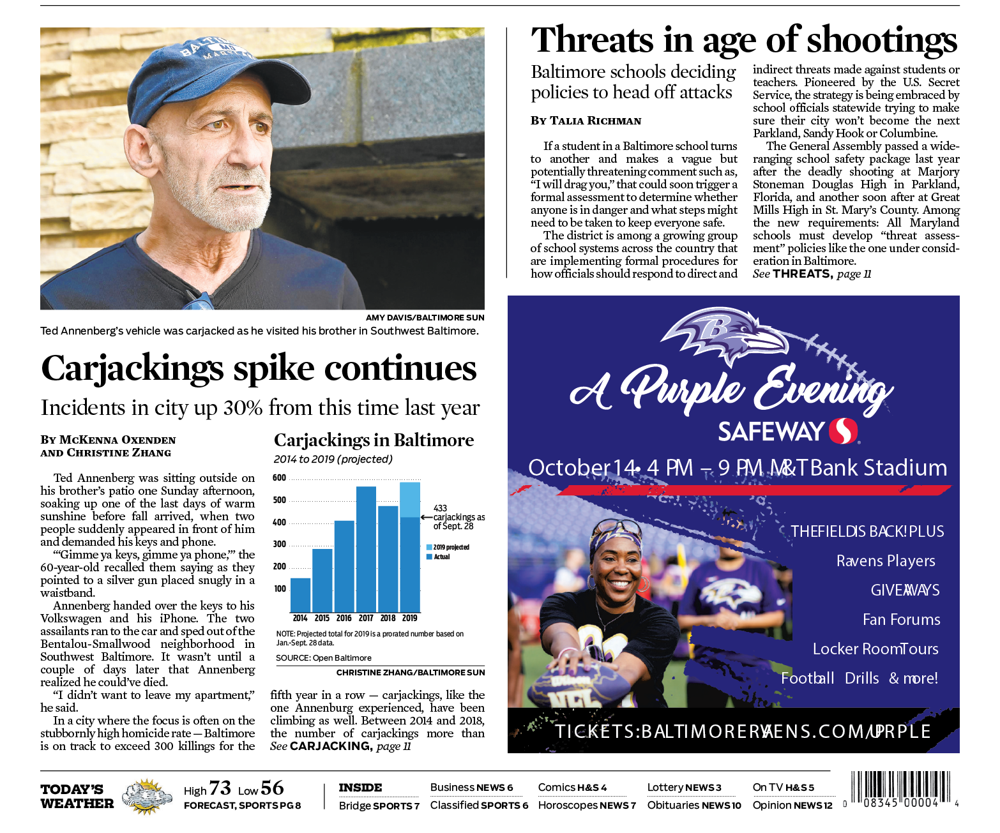

# Baltimore city carjackings analysis 2019

## Baltimore Sun analysis

By [Christine Zhang](mailto:czhang@baltsun.com)

The Baltimore Sun analyzed crime data from [Open Baltimore](https://data.baltimorecity.gov/Public-Safety/BPD-Part-1-Victim-Based-Crime-Data/wsfq-mvij) for a Oct. 9, 2019 story about the increase in carjackings in 2019 titled ["Carjackings spike continues in Baltimore, with incidents up 30% from this time last year"](https://www.baltimoresun.com/news/crime/bs-md-ci-cr-carjackings-rise-in-baltimore-20191009-tfj4xqx4sjhuhikxxxqp5re6im-story.html) (print headline for Oct. 10, 2019: "Carjackings spike continues").

The Sun's findings and analysis are available in the "analysis" markdown file in this repository: [`analysis.md`](https://github.com/baltimore-sun-data/balt-city-carjackings-2019/blob/master/analysis.md).

If you'd like to run the code yourself in R, you can download the R Markdown file [`analysis.Rmd`](https://github.com/baltimore-sun-data/balt-city-carjackings-2019/blob/master/analysis.Rmd) along with the data in the [`input`](https://github.com/baltimore-sun-data/balt-city-carjackings-2019/tree/master/input) folder.

https://twitter.com/baltsundata

## Community Contributions

There are many angles to explore with this data, beyond just the ones we looked into for our story. 

**Have something to contribute?** Send us a pull request or contact us on Twitter [@baltsundata](https://twitter.com/baltsundata) or via [email](mailto:czhang@baltsun.com).

You can also fork a copy of this repo to your own account.

## Licensing

All code in this repository is available under the [MIT License](https://opensource.org/licenses/MIT). The data files are available under the [Creative Commons Attribution 4.0 International](https://creativecommons.org/licenses/by/4.0/) (CC BY 4.0) license.